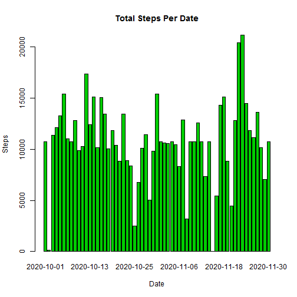

# Reproducible Research: Peer Assessment 1
Activity Monitoring Data Set

========================================================

This is an R markdown document detailing the steps of analysis for the 
activities monitoring data.

## Loading and preprocessing the data
The original csv file has been loaded into the current directory.
Preprocessing to change the date field to a Date class is done.


```r
setwd("C:/Users/Joanne/Desktop/DS Course/Practice")
##Read in csv file after unzipping and adding file to current directory
activity<-read.csv("Activity/activities.csv")

##check for names (Steps, date, interval) 
names(activity)
```

```
## [1] "steps"    "date"     "interval"
```

```r
##change date field to date class
activity$date <-as.Date(activity$date, "%m/%d/%y")
##verify date class
class(activity$date)
```

```
## [1] "Date"
```

```r
##view fields in data
head(activity)
```

```
##   steps       date interval
## 1    NA 2020-10-01        0
## 2    NA 2020-10-01        5
## 3    NA 2020-10-01       10
## 4    NA 2020-10-01       15
## 5    NA 2020-10-01       20
## 6    NA 2020-10-01       25
```

## What is mean total number of steps taken per day?
Total number of steps per day is shown below along with the median

```r
##create data set for steps to date using only complete cases, i.e. no NAs
allcomplete.activity <- aggregate(steps ~ date, activity, sum, na.rm=TRUE)


barplot(allcomplete.activity$steps, names.arg = allcomplete.activity$date, col="3", main="Total Steps Per Date", 
     xlab="Date", ylab="Steps")
```

 

```r
mean(allcomplete.activity$steps)
```

```
## [1] 10766
```

```r
median(allcomplete.activity$steps)
```

```
## [1] 10765
```
## What is the average daily activity pattern?
Graph shows mean of each interval activity. Activity builds after interval 500 and has reached peak and declined by interval 1000.  The peak occurs at interval 835 with an average of 206 steps.


```r
interval.aggdata<-aggregate(steps~interval, FUN=mean, data=activity, 
                            na.rm=TRUE)

plot(interval.aggdata$interval, interval.aggdata$steps, "l", main="Number of Steps by Interval", xlab="Interval", ylab="Steps")
```

 

```r
##Find max of data
interval.aggdata [which.max(interval.aggdata$steps), ]
```

```
##     interval steps
## 104      835 206.2
```

## Imputing missing values
There are 2304 missing values in the step field.  Since the assignment required us to change them, the interval average should be closer to the expected, than a day average.  After imputing mean and median are 10766 still very close to the mean and median from the original dataset when excluding NAs. 


```r
##copy activity data in order to fill in NAs and create a new dataset
imputted_activity<- activity

##Count number of NAs        
sum(is.na(imputted_activity))
```

```
## [1] 2304
```

```r
##verifying that all data is present
nrow(imputted_activity)
```

```
## [1] 17568
```

```r
##fill in nas using the interval average from interval.aggdata.  

for (i in 1:nrow(imputted_activity)){
        if (is.na(imputted_activity$steps[i])){
                interval_val <- imputted_activity$interval[i]
                row_id <- which(interval.aggdata$interval == interval_val)
                steps_val <- interval.aggdata$steps[row_id]
                imputted_activity$steps[i] <- steps_val
        }
}

##verify that all nas have a value, i.e. no nas and that number of rows is still the same

sum(is.na(imputted_activity))
```

```
## [1] 0
```

```r
head(imputted_activity)
```

```
##     steps       date interval
## 1 1.71698 2020-10-01        0
## 2 0.33962 2020-10-01        5
## 3 0.13208 2020-10-01       10
## 4 0.15094 2020-10-01       15
## 5 0.07547 2020-10-01       20
## 6 2.09434 2020-10-01       25
```

```r
nrow(imputted_activity)
```

```
## [1] 17568
```

```r
##Aggregate sum of steps per day
nonas.activity <- aggregate(steps ~ date, imputted_activity, sum)

##Using barplot show steps per day
barplot(nonas.activity$steps, names.arg = nonas.activity$date, col="3", main="Total Steps Per Date", 
     xlab="Date", ylab="Steps")
```

 

```r
##display mean and median
mean(nonas.activity$steps)
```

```
## [1] 10766
```

```r
median(nonas.activity$steps)
```

```
## [1] 10766
```

## Are there differences in activity patterns between weekdays and weekends?
Yes, the graphs clearly show more activity in the weekdays.  Note the density
of the distribution.

```r
##change date field to date class
##nonas.activity$date <-as.Date(nonas.activity$date, "%m/%d/%y")
##verify date class
##class(nonas.activity$date)

##add new variable day to show if date is a weekend or weekday
imputted_activity$day <- ifelse(weekdays(imputted_activity$date) 
                              %in% c("Satuday", "Sunday"),"weekend", "weekday")

##verify existence of new column day showing weekend or weekday based on date
head(imputted_activity)
```

```
##     steps       date interval     day
## 1 1.71698 2020-10-01        0 weekday
## 2 0.33962 2020-10-01        5 weekday
## 3 0.13208 2020-10-01       10 weekday
## 4 0.15094 2020-10-01       15 weekday
## 5 0.07547 2020-10-01       20 weekday
## 6 2.09434 2020-10-01       25 weekday
```

```r
##library package ggplot2 must be installed and is called here
library(ggplot2)

## To show the steps broken down by weekday and weekend
ggplot(imputted_activity, aes(x=interval, y=steps)) + 
    geom_line(color="blue", size=1) + 
    facet_wrap(~ day, nrow=2, ncol=1) +
    labs(x="Interval", y="Number of steps") +
    theme_bw()
```

 

##Conclusion
Much more activity is recorded on weekdays.
